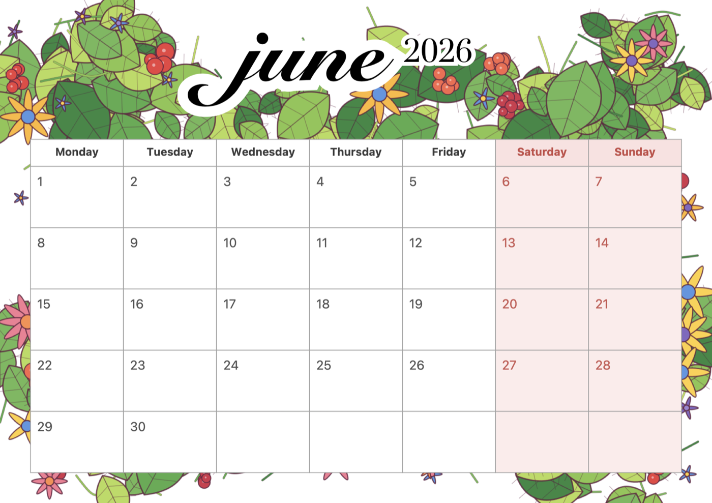
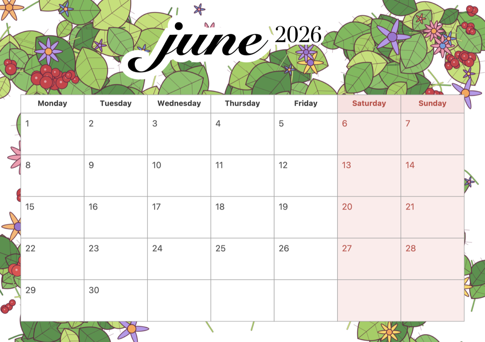
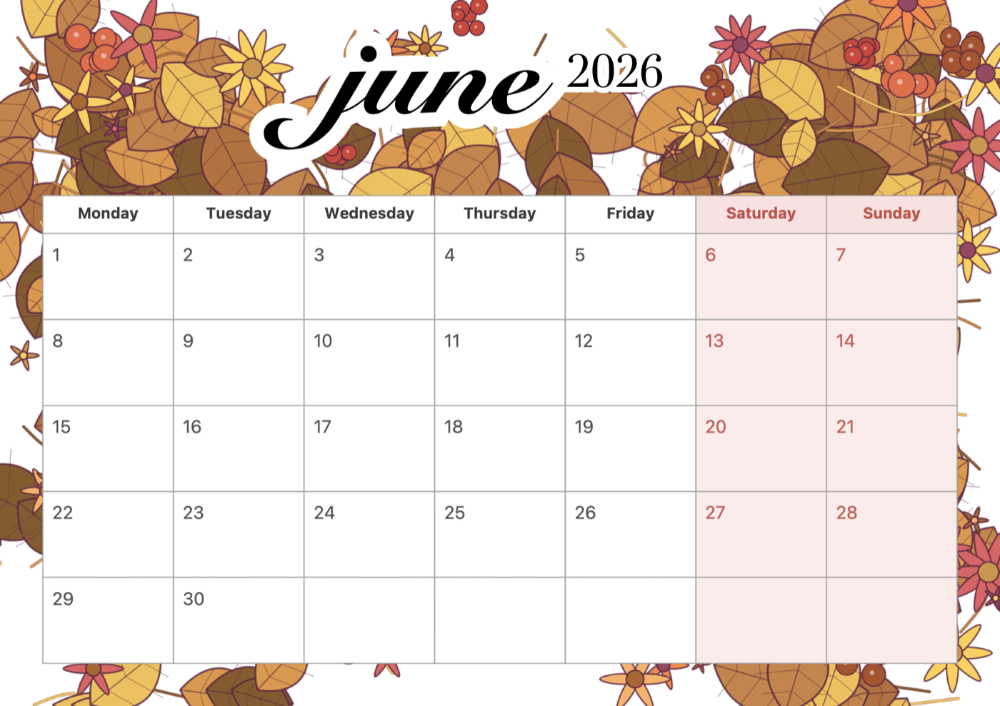
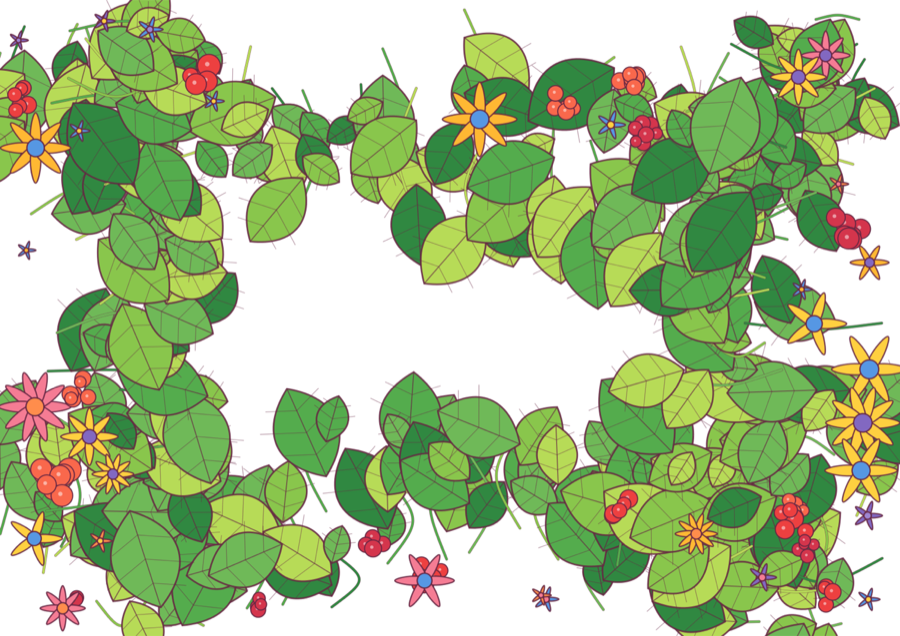
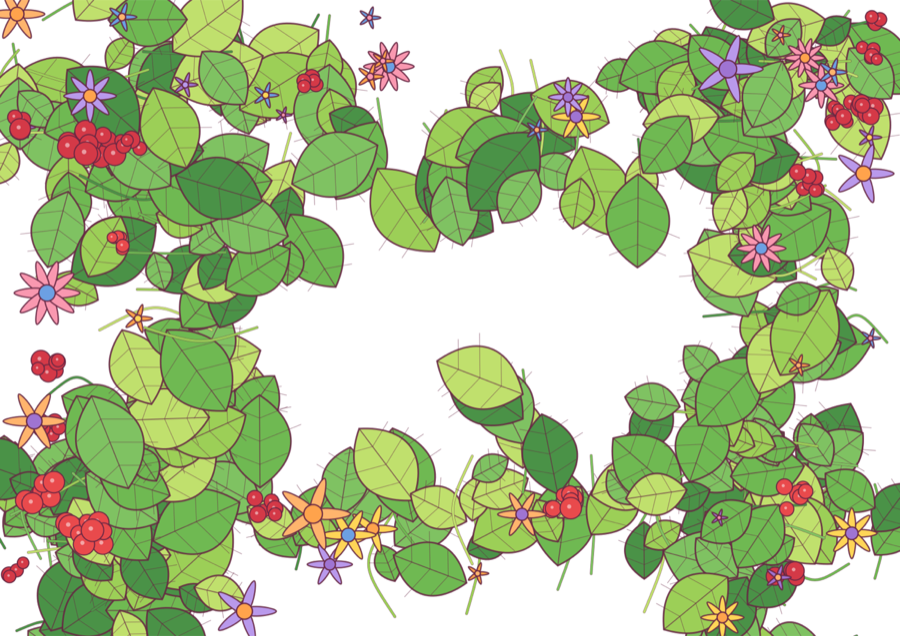
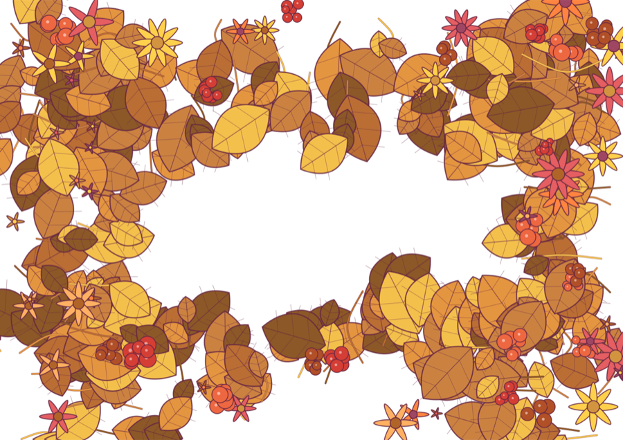

# Calendar PDF Generator

Generates printable A4 landscape monthly calendars in PDF, with a floral border background and white day cells.

## Samples

Calendar pages — three different backgrounds for the same month:

| Vibrant | Spring | Autumn |
| --- | --- | --- |
|  |  |  |

Procedurally generated background borders (the calendar grid is overlaid on top of these):

| Vibrant | Spring | Autumn |
| --- | --- | --- |
|  |  |  |

## Requirements

- macOS with Swift toolchain (`swift` on `PATH`)
- Uses AppKit / CoreGraphics — macOS only

## Files

| File | Purpose |
| --- | --- |
| `Generate Calendar.app` | Double-click in Finder to launch calendar generator. |
| `Generate Backgrounds.app` | Double-click in Finder to regenerate the border pool. |
| `generate_calendar_pdf.swift` | Builds the calendar PDF for a chosen month/year. |
| `generate_backgrounds.swift` | Procedurally generates floral border PNG backgrounds into `backgrounds/`. |
| `backgrounds/` | Pool of background images. Picked at random when generating calendars. |
| `image-1776956639655.png` | Legacy fallback background (used if `backgrounds/` is empty). |

## Quick start

### Option A — double-click in Finder (easiest)

1. **Generate Backgrounds.app** — double-click to refresh the border pool.
2. **Generate Calendar.app** — double-click, type month and year when prompted.

Both apps open Terminal and run the matching Swift script. First run may show a Gatekeeper warning — right-click → Open → Open to bypass it once.

### Option B — Terminal

```bash
# 1. Generate a set of border backgrounds (run once or whenever you want fresh ones)
swift generate_backgrounds.swift

# 2. Generate a calendar — script will prompt for month and year
swift generate_calendar_pdf.swift
# Month (1-12): 6
# Year (e.g. 2026): 2026
# → produces 3 PDFs with 3 different backgrounds so you can pick a favorite
```

## Calendar generator

Run:

```bash
swift generate_calendar_pdf.swift            # 3 PDFs, 3 different backgrounds
swift generate_calendar_pdf.swift path.png   # 1 PDF using the specified background
```

You'll be prompted:

```
Month (1-12): 6
Year (e.g. 2026): 2026
```

By default the generator produces **3 PDFs**, each with a different randomly chosen background from `./backgrounds/`. When 3+ palettes are available, it picks one per distinct palette so the variants look meaningfully different. Output filename:

```
<MonthName>-<Year>-calendar-A4-landscape-<bg-stem>.pdf
```

Pass an explicit image path as the CLI argument to bypass the picker and produce a single PDF.

Background selection priority:
1. CLI arg (if provided and file exists) → 1 PDF
2. Up to 3 distinct-palette images from `./backgrounds/` → 3 PDFs
3. Legacy `./image-1776956639655.png` → 1 PDF
4. No background (white page) → 1 PDF

## Background generator

Run:

```bash
swift generate_backgrounds.swift          # 1 PNG per palette
swift generate_backgrounds.swift 3        # 3 variants per palette (15 total)
```

Output goes to `./backgrounds/` as `bg-<palette>[-N].png`. A4 landscape at 2× scale.

Available palettes:

- `spring` — fresh greens, yellow/pink flowers, red berries
- `autumn` — warm oranges, browns, dark green leaves
- `pastel` — sage, blush, lavender, cream
- `tropical` — deep greens with magenta and teal accents
- `monochrome-green` — botanical greens only

Each background draws stems, leaves, flowers, and berry clusters along the four page borders, leaving the center white so the calendar grid sits cleanly on top.

## Customizing

- **Add new palettes**: append a `Palette` to the `palettes` array in `generate_backgrounds.swift`.
- **Use your own images**: drop PNG/JPG files into `backgrounds/`. They'll be picked up automatically.
- **Layout tweaks**: margins, cell sizes, fonts, and colors are constants near the top of `generate_calendar_pdf.swift`.
- **Locale / week start**: weekday names and Monday-based start are hard-coded in `generate_calendar_pdf.swift`. Change the `weekdayNames` array and `mondayBasedOffset` calculation if you need a different layout.
