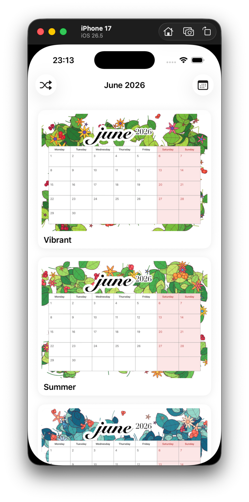
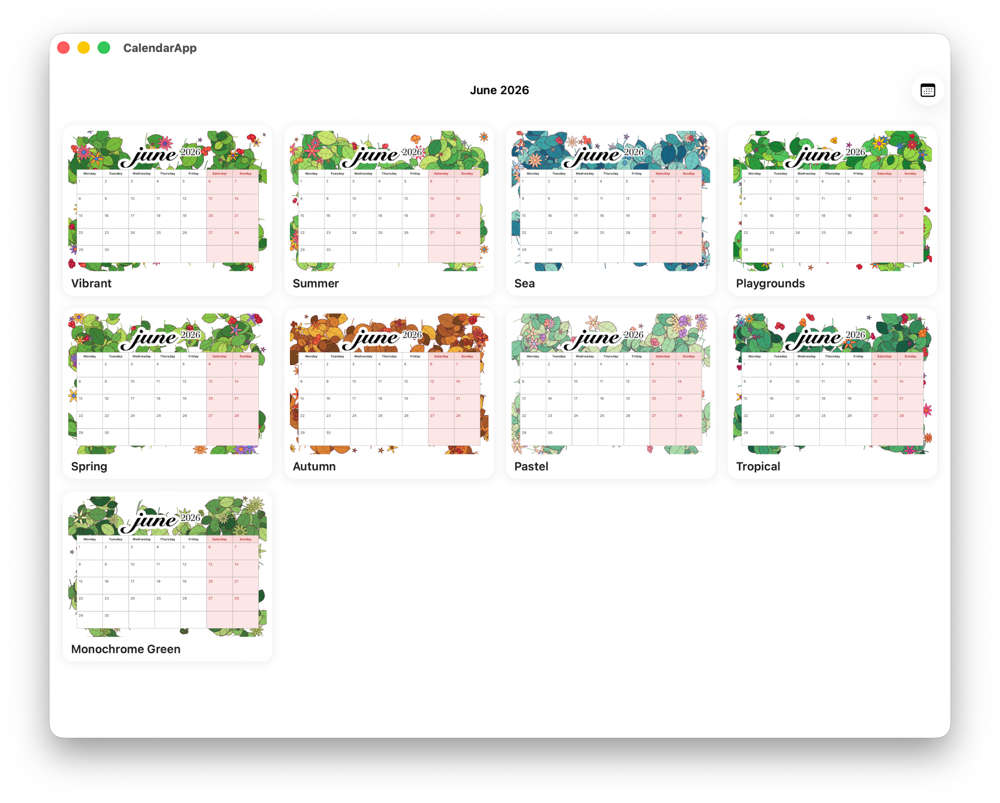

# Calendar PDF Generator

Generates printable A4 landscape monthly calendars in PDF, with a floral border background and white day cells. Ships as command-line Swift scripts **and** a multiplatform SwiftUI app for Mac, iPhone, and iPad.

## The app

| iPhone | Mac |
| --- | --- |
|  |  |

Browse every palette as a live preview, shuffle the floral arrangement, import your own background image, pick any month and year, then save or share the PDF. See [Mac / iOS app](#mac--ios-app) to download.

## Samples

Calendar pages — same month (June 2026) rendered with every palette:

| Vibrant | Summer | Sea |
| --- | --- | --- |
|  |  |  |

| Playgrounds | Spring | Autumn |
| --- | --- | --- |
|  |  |  |

| Pastel | Tropical | Monochrome Green |
| --- | --- | --- |
|  |  |  |

Procedurally generated background borders (the calendar grid is overlaid on top of these):

| Vibrant | Summer | Sea |
| --- | --- | --- |
|  |  |  |

| Playgrounds | Spring | Autumn |
| --- | --- | --- |
|  |  |  |

| Pastel | Tropical | Monochrome Green |
| --- | --- | --- |
|  |  |  |

## Mac / iOS app

A multiplatform SwiftUI app that wraps these scripts lives in [`CalendarApp/`](CalendarApp/). Bundle id `dollar2048.calendar-generator`. Requires macOS 14 / iOS 17 or later.

App features:

- Gallery of every palette rendered live (no precomputed assets).
- **Shuffle** button re-rolls the floral border into a fresh random arrangement.
- **Add your own** background image — pick from Photos (iOS) or a file (Mac); it fills the page behind the grid.
- Month + year picker; save (Mac) or share (iOS) the resulting PDF.

### Install on macOS

1. Download `CalendarApp-macOS.zip` from the [**latest release**](https://github.com/dollar2048/calendar/releases/latest).
2. Unzip and drag `CalendarApp.app` to `/Applications`.
3. First launch: the build is ad-hoc signed (not notarized), so macOS Gatekeeper will warn. **Right-click the app → Open → Open** to launch it once; afterwards it opens normally.

If no release is listed yet, build it yourself — see [`CalendarApp/README.md`](CalendarApp/README.md).

### Build from source

Open `CalendarApp/CalendarApp.xcodeproj` in Xcode and run on **My Mac**, an **iPhone/iPad** simulator, or a device.

## Requirements

- macOS with Swift toolchain (`swift` on `PATH`)
- Uses AppKit / CoreGraphics — macOS only

## Files

| File | Purpose |
| --- | --- |
| `Generate Calendar.app` | Double-click in Finder to launch calendar generator. |
| `Generate Backgrounds.app` | Double-click in Finder to regenerate the border pool. |
| `generate_calendar_pdf.swift` | Builds the calendar PDF for a chosen month/year. |
| `generate_backgrounds.swift` | Procedurally generates floral border PNG backgrounds into `backgrounds/`. |
| `backgrounds/` | Pool of background images. Picked at random when generating calendars. |
| `image-1776956639655.png` | Legacy fallback background (used if `backgrounds/` is empty). |

## Quick start

### Option A — double-click in Finder (easiest)

1. **Generate Backgrounds.app** — double-click to refresh the border pool.
2. **Generate Calendar.app** — double-click, type month and year when prompted.

Both apps open Terminal and run the matching Swift script. First run may show a Gatekeeper warning — right-click → Open → Open to bypass it once.

### Option B — Terminal

```bash
# 1. Generate the border pool (one PNG per palette)
swift generate_backgrounds.swift

# 2. Generate calendars — one PDF per background in ./backgrounds/
swift generate_calendar_pdf.swift
# Month (1-12): 6
# Year (e.g. 2026): 2026
# → produces one PDF per palette (9 by default) so you can pick a favorite
```

## Calendar generator

Run:

```bash
swift generate_calendar_pdf.swift            # 1 PDF per image in ./backgrounds/
swift generate_calendar_pdf.swift path.png   # 1 PDF using only the specified background
```

You'll be prompted:

```
Month (1-12): 6
Year (e.g. 2026): 2026
```

By default the generator produces **one PDF per image found in `./backgrounds/`** (sorted alphabetically) so you can compare every palette and pick a favorite. Output filename:

```
<MonthName>-<Year>-calendar-A4-landscape-<bg-stem>.pdf
```

Pass an explicit image path as the CLI argument to bypass the folder scan and produce a single PDF.

Background selection priority:
1. CLI arg (if provided and file exists) → 1 PDF
2. All PNG/JPG images in `./backgrounds/` → 1 PDF each
3. Legacy `./image-1776956639655.png` → 1 PDF
4. No background (white page) → 1 PDF

## Background generator

Run:

```bash
swift generate_backgrounds.swift          # 1 PNG per palette
swift generate_backgrounds.swift 3        # 3 variants per palette (15 total)
```

Output goes to `./backgrounds/` as `bg-<palette>[-N].png`. A4 landscape at 2× scale.

Available palettes:

- `vibrant` — punchy bright greens, mustard yellow, magenta, red, indigo
- `summer` — sun yellow, watermelon pink, coral, sky blue, fresh green
- `sea` — teal, navy, coral, sand, seafoam
- `playgrounds` — primary red/blue/yellow/green crayon brights
- `spring` — fresh greens, yellow/pink flowers, red berries
- `autumn` — warm oranges, browns, dark green leaves
- `pastel` — sage, blush, lavender, cream
- `tropical` — deep greens with magenta and teal accents
- `monochrome-green` — botanical greens only
- `winter` — frosted evergreens, icy whites/blues, holly-red berries

Each background draws stems, leaves, flowers, and berry clusters along the four page borders, leaving the center white so the calendar grid sits cleanly on top.

## Customizing

- **Add new palettes**: append a `Palette` to the `palettes` array in `generate_backgrounds.swift`.
- **Use your own images**: drop PNG/JPG files into `backgrounds/` (scripts pick them up automatically), or in the app tap **Add your own** to import one.
- **Layout tweaks**: margins, cell sizes, fonts, and colors are constants near the top of `generate_calendar_pdf.swift`.
- **Locale / week start**: weekday names and Monday-based start are hard-coded in `generate_calendar_pdf.swift`. Change the `weekdayNames` array and `mondayBasedOffset` calculation if you need a different layout.
